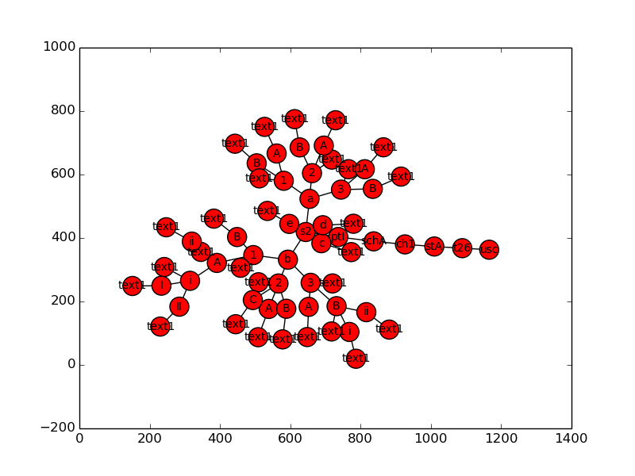

Quick Start
=================================================

This client library provides an interface to the AsAmended US Code API.

Getting Setup
--------------------

To get started, install it using `pip <http://www.pip-installer.org/en/latest/>`_:

.. code-block:: bash

  $ pip install asamended

Next, specify your API key by setting it with the environment variable ASAMENDED_USER_KEY:

.. code-block:: bash

  $ export ASAMENDED_USER_KEY=1234567890

Trying Things Out
---------------------------

The easiest way to get familiar with the API is by trying out some basic examples. First we'll print a simple table of contents to the console. Next we'll retrieve an entire section and vizualize it with networkx. Finally, well run a search and print the citations of the matching nodes.

Basic Table of Contents View
+++++++++++++++++++++++++++++++++

First we'll print a basic table of contents to the console. To display the titles of the US Code, we'll request all immediate  descendants of the root node, whose id is "/us/usc".

    >>> from asamended import uscode
    >>> usc = uscode.descendants(ident="/us/usc", max_depth=1)
    >>> for title in usc.children.order_by('order'):
    ...     print title.citation(), title['heading']

This snippet results in the following output:

.. code-block:: text

    1 U.S.C. GENERAL PROVISIONS
    2 U.S.C. THE CONGRESS
    3 U.S.C. THE PRESIDENT
    4 U.S.C. FLAG AND SEAL, SEAT OF GOVERNMENT, AND THE STATES
    5 U.S.C. GOVERNMENT ORGANIZATION AND EMPLOYEES
    6 U.S.C. DOMESTIC SECURITY
    7 U.S.C. AGRICULTURE
    ...

Vizualizing a Full Section
++++++++++++++++++++++++++++++

Next let's retrieve 26 U.S.C. § 2 and draw it using networkx and pygraphviz (don't forget to pip install pygraphviz and matplotlib first). To fetch an entire section, rather than just the immediate children of a certain node, just leave out the ``max_depth`` parameter. This will retrieve all children of the specified node, up to 1000 nodes per page. For most sections, this retrieves all their descendants in a single API call::

    >>> # First fetch 26 USC section 2.
    >>> t26s2 = uscode.descendants(ident="/us/usc/t26/s2")

Next we'll convert it to a networkx.DiGraph and draw it::

    >>> t26s2.draw()

And we'll need matplotlib to display it::

    >>> from matplotlib import pyplot as plt
    >>> plt.show()

And the graph looks like this:

Search for Something and Print The Matching Citations
+++++++++++++++++++++++++++++++++++++++++++++++++++++++++

Now we'll search for something, and for each matching node in the US Code hierarchy, we'll print its citation. First we query the search endpoint::

    >>> # Query the search endpoint.
    >>> results = uscode.search(q="insects")

Next we retrieve the corresponding nodes from the database and loop over them::

    >>> for node in results.iternodes():
    ...     print node.citation(), node.get('heading') or node.get('text')
            print

And this prints:

.. code-block:: text

    16 U.S.C. § 6551(a)(1) high levels of tree mortality resulting from insect infestation (including the interaction between insects and diseases) may result in—

    16 U.S.C. § 460oo(e)(1) those necessary to prevent and control wildfire, insects, diseases, soil erosion, and other damaging agents including timber harvesting activities necessary to prevent catastrophic mortality from insects, diseases or fire;

    16 U.S.C. § 2101(a)(6) insects and diseases affecting trees occur and sometimes create emergency conditions on all land, whether Federal or non-Federal, and efforts to prevent and control such insects and diseases often require coordinated action by both Federal and non-Federal land managers;

    16 U.S.C. § 545a(g) Insects and disease
    ...
